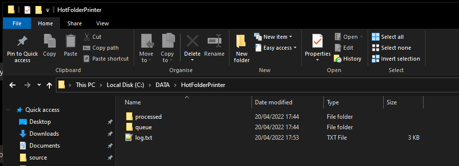
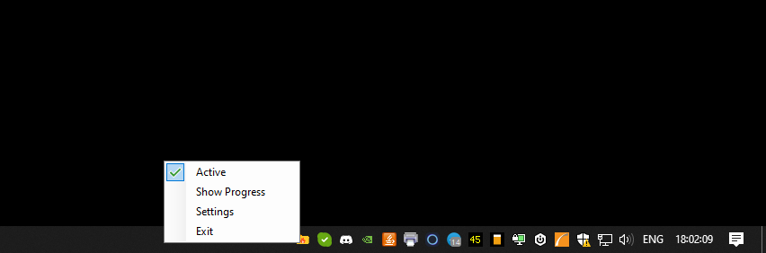
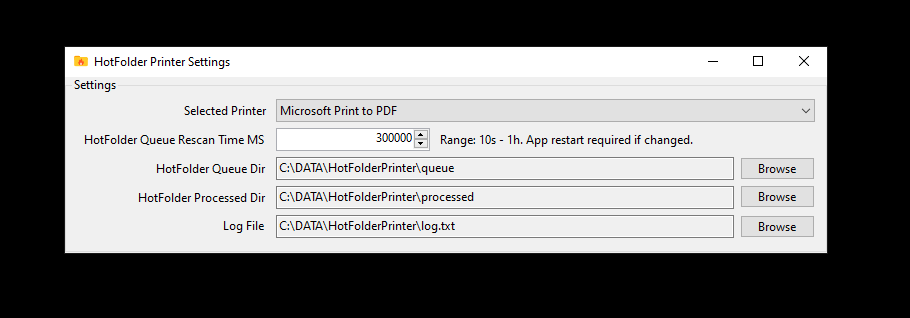

# HotFolderPrinterFoxitPdf project

An example project using `Foxit Pdf Reader` to automatically print pdf files from a folder. https://www.foxit.com/  
HotFolderPrinterFoxitPdfSetup project creates MSI installer. `%appdata%\HotFolderPrinterFoxitPdf\HotFolderPrinterFoxitPdf`  

## How does it work

* Periodically scans a folder with a Timer
* Looks for PDF files `"*.pdf"` in `queueDir`
* Iterates on this list of pdf files, then creates a print job using `Foxit Pdf Reader command line option`
* Moves the printed pdf files to `processedDir`
* Write logs

## Usage

* Try with `Microsoft Print to PDF` printer first. Default output location is your `Documents` folder.
* Make sure you configure your default printer settings first. For example using only black and white colors, paper size, etc.

## Screenshots

  
  
  

## Support

Nah.

## License

WTFPL